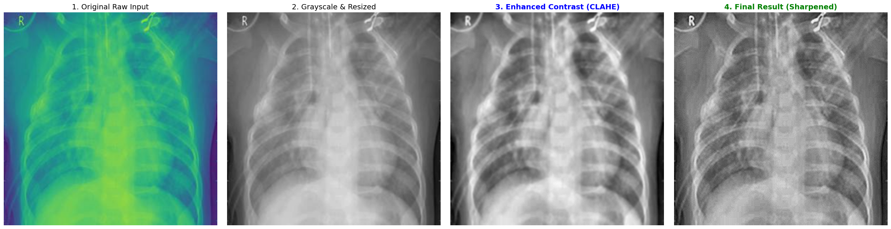

# Image-Enhancement-Project
Enhancing Pneumonia detection accuracy in Chest X-rays using Noise Reduction and Image Preprocessing techniques.

## Preprocessing Pipeline
To improve the model's accuracy, we applied a comprehensive preprocessing pipeline to the X-ray images. This includes:
1.  **Grayscale Conversion:** Simplifying data.
2.  **Denoising:** Removing thermal noise using Gaussian Blur.
3.  **Contrast Enhancement (CLAHE):** Highlighting lung details without overexposure.
4.  **Sharpening:** Emphasizing edges of ribs and potential opacities.

### Pipeline Visualization
Below is a demonstration of the transformation process on a raw sample image:

---
